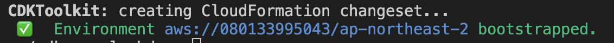

# cdk-sqs-lambda
aws sqs를 활용한 로그 저장

# 설치

## cdk
npm install -g aws-cdk
npm install

# 실행하기

## 초기 1회 실행 (cdk - 계정 동기화)
cdk bootstrap --profile {AWS 계정 Credential}

## cdk 컴파일
cdk synth

## 변경사항 확인
cdk diff

## 배포
cdk deploy

